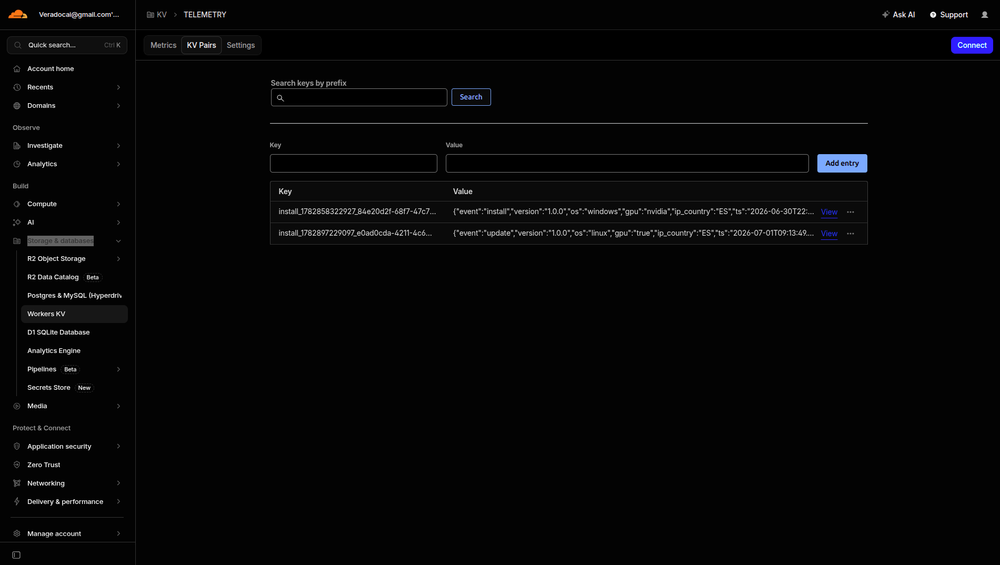

# Description
Veradoc Observability using Cloudflare Workers. We used this infraestructure because is free up to 100k requests/day, using a KV (Key/Value Database) free up to 100k reads/day. For VeraDoc is enough for years.

## Create Worker
We are going to create a Cloudflare Worker(like AWS lambda or Azure Functions) in Cloudflare to serve a simple telemetry endpoint used by Veradoc deployemnt web scripts to send info about deployment. Steps 

## STEPS to deploy Observability infrastructure in Cloudflare

Before implement any Worker, please create a new account in Cloudflare.

- **STEP01**: Install Cloudflare CLI
Wrangler is the CLI for the Cloudflare Developer Platform.
```shell
$ npm install -g wrangler
 ```

- **STEP02**: Login into your Cloudflare account just created
```shell
$ wrangler login

 ⛅️ wrangler 4.106.0
────────────────────
Attempting to login via OAuth...
Opening a link in your default browser: https://dash.cloudflare.com/oauth2/auth?response_type=code&client_id=54d11594-84e4-41aa-b438-e81b8fa78ee7&redirect_uri=http%3A%2F%2Flocalhost%3A8976%2Foauth%2Fcallback&scope=account%3Aread%20user%3Aread%20workers%3Awrite%20workers_kv%3Awrite%20workers_routes%3Awrite%20workers_scripts%3Awrite%20workers_tail%3Aread%20d1%3Awrite%20pages%3Awrite%20zone%3Aread%20ssl_certs%3Awrite%20ai%3Awrite%20ai-search%3Awrite%20ai-search%3Arun%20websearch.run%20agent-memory%3Awrite%20queues%3Awrite%20pipelines%3Awrite%20secrets_store%3Awrite%20artifacts%3Awrite%20flagship%3Awrite%20containers%3Awrite%20cloudchamber%3Awrite%20connectivity%3Aadmin%20email_routing%3Awrite%20email_sending%3Awrite%20browser%3Awrite%20offline_access&state=zVQJX4Zv9SmxUDC219MD7q.r86KWiR1~&code_challenge=WtXcuTK8pFwYA3o01UsIUv5VtBUDJVq275P-KhRXzXw&code_challenge_method=S256
Successfully logged in.

? Before you go, Wrangler detected AI coding agents that may not be best configured to work with Cloudflare: Claude Code, Cursor. Would you like Wrangler to automatically install Cloudflare skills for the best experience? › (Y/n) <-- Select n

```

- **STEP03**: Scaffold a new Cloudflare project called `veradoc-telemetry` from template in your computer, used to be implemented and deploy your telemetry worker.
```shell
$ wrangler init veradoc-telemetry
⛅️ wrangler 4.106.0
────────────────────
🌀 Running npm create cloudflare veradoc-telemetry --...
Need to install the following packages:
create-cloudflare@2.70.7
Ok to proceed? (y) y

npx
create-cloudflare veradoc-telemetry

👋 Welcome to create-cloudflare v2.70.7!
🧡 Let's get started.
📊 Cloudflare collects telemetry about your usage of Create-Cloudflare.

Learn more at: https://github.com/cloudflare/workers-sdk/blob/main/packages/create-cloudflare/telemetry.md

╭ Create an application with Cloudflare Step 1 of 3
│
├ In which directory do you want to create your application?
│ dir ./veradoc-telemetry
│
╰ What would you like to start with? 
  ● Hello World example  <-- Select this template. A simple Cloudflare template
  ○ Framework Starter 
  ○ Application Starter 
  ○ Template from a GitHub repo
Which template would you like to use? 
  ● Worker only <-- Select this option: One simple worker with one endpoint
  ○ Static site 
  ○ SSR / full-stack app 
  ○ Worker + Durable Objects 
  ○ Worker + Durable Objects + Assets 
  ○ Workflow 
  ○ Scheduled Worker (Cron Trigger) 
  ○ Queue consumer & producer Worker 
  ○ API starter (OpenAPI compliant) 
╭ Configuring your application for Cloudflare Step 2 of 3
│
├ Retrieving current workerd compatibility date
│ compatibility date 2026-06-30
│
╰ You're in an existing git repository. Do you want to use git for version control? 
  Yes / No <-- Select Yes
Deploy with Cloudflare Step 3 of 3
│
╰ Do you want to deploy your application? 
  Yes / No <-- Select Yes to be deployed just now a simple worker. Later we implementate our particular worker.
SUCCESS  Application created successfully!

💻 Continue Developing
Change directories: cd veradoc-telemetry
Deploy: npm run deploy

📖 Explore Documentation
https://developers.cloudflare.com/workers

🐛 Report an Issue
https://github.com/cloudflare/workers-sdk/issues/new/choose

💬 Join our Community
https://discord.cloudflare.com
```

Now We can check this simple worker like this, obtain a Hello World reponse from worker
```shell
$ curl https://veradoc-telemetry.veradocai.workers.dev
Hello World!
```

- **STEP04**: implement our particular Cloudflare Worker using javascript using the project file called `index.js`. Go to src/index.js and set the particular code for our worker:

```shell
$ cd veradoc-telemetry
$ nano ./src/index.js

export default {
  async fetch(request, env) {
    if (request.method === "OPTIONS") {
      return new Response(null, { headers: corsHeaders() });
    }

    if (request.method !== "POST") {
      return new Response("Method not allowed", { status: 405 });
    }

    const body = await request.json().catch(() => ({}));

    const key = `install_${Date.now()}_${crypto.randomUUID()}`;
    await env.TELEMETRY.put(key, JSON.stringify({
      ...body,
      ip_country: request.cf?.country ?? "unknown",
      ts: new Date().toISOString()
    }));

    return new Response(JSON.stringify({ ok: true }), {
      headers: { "Content-Type": "application/json", ...corsHeaders() }
    });
  }
};

function corsHeaders() {
  return {
    "Access-Control-Allow-Origin": "*",
    "Access-Control-Allow-Methods": "POST, OPTIONS",
    "Access-Control-Allow-Headers": "Content-Type"
  };
}
```

- **STEP05**: create a KV (Key/value) Cloudflare

Execute this command to create in Cloudflare the KV(Key/Value Database) Namespace called `TELEMETRY` where save all telemetry events sent by Veradoc post deployment scripts. The result also told us that we must copy and paste the `kv_namespaces` inside wrangler.jsonc file.

```shell
$ wrangler kv:namespace create TELEMETRY

⛅️ wrangler 4.106.0
────────────────────
Resource location: remote 

🌀 Creating namespace with title "TELEMETRY"
✨ Success!
To access your new KV Namespace in your Worker, add the following snippet to your configuration file:
{
  "kv_namespaces": [
    {
      "binding": "TELEMETRY",
      "id": "25b5bdf25aaf4abbb3f93def17f3f895"
    }
  ]
}
? Would you like Wrangler to add it on your behalf? › (Y/n) <-- Y to set wrangler.jsonc configuration file.
? For local dev, do you want to connect to the remote resource instead of a local resource?  <-- N
```

Edit the the file `wrangler.jsonc` updated and check that the `kv_namespaces` argument where bind the KV Database with our worker called `veradoc-telemetry` exist.

```shell
{
	"$schema": "node_modules/wrangler/config-schema.json",
	"name": "veradoc-telemetry",
	"main": "src/index.js",
	"compatibility_date": "2026-06-30",
	"observability": {
		"enabled": true
	},
	"upload_source_maps": true,
	"compatibility_flags": [
		"nodejs_compat"
	],
	"kv_namespaces": [ <-- This is the binding between the worker and the KV database
		{
			"binding": "TELEMETRY",
			"id": "25b5bdf25aaf4abbb3f93def17f3f895"
		}
	]
    ...
}    
```

- **STEP06**: Redeploy Cloudflare Worker with this new configuration:

```shell
$ npm run deploy

veradoc-telemetry@0.0.0 deploy
wrangler deploy

 ⛅️ wrangler 4.106.0
────────────────────
Total Upload: 1.13 KiB / gzip: 0.59 KiB
Worker Startup Time: 6 ms
Your Worker has access to the following bindings:
Binding                                               Resource          
env.TELEMETRY (25b5bdf25aaf4abbb3f93def17f3f895)      KV Namespace      

Uploaded veradoc-telemetry (11.37 sec)
Deployed veradoc-telemetry triggers (6.75 sec)
  https://veradoc-telemetry.veradocai.workers.dev
Current Version ID: b8dbe0a1-2b42-4e3a-bf92-9912164ee0e0
```

- **STEP06**: Check the Cloudflare Worker with a simulated event

Ingest a sample Veradoc event from curl
```shell
$ curl -X POST https://veradoc-telemetry.veradocai.workers.dev \
  -H "Content-Type: application/json" \
  -d '{"event":"install","version":"1.0.0","os":"windows","gpu":"true"}'
```

List the events from KV Namespace TELEMETRY
```shell
$ wrangler kv key list --binding TELEMETRY --remote
[
  {
    "name": "install_1782858322927_84e20d2f-68f7-47c7-9a91-5996604dccbe"
  }
]

```

Get the details of the event just ingested:
```shell
$ wrangler kv key get --binding TELEMETRY "install_1782858322927_84e20d2f-68f7-47c7-9a91-5996604dccbe" --remote
{"event":"install","version":"1.0.0","os":"windows","gpu":"true","ip_country":"ES","ts":"2026-06-30T22:25:22.927Z"}
```

## Veradoc event observability

Telemetry event arguments:

- **event**: event type when deploy the system. Values: install, update.
- **ip_country**: country where is installed Veradoc. Sample: ES, US, etc
- **Version**: Veradoc version deployed. 
- **os**: the system operator used to deploye Veradoc. Values: linux, windows
- **gpu**: if the installation used or not GPU. Values: true, false
- **ts**: timestamp when is deployed Veradoc.

To access to these observability go to Cloudflare Portal from this link:

https://dash.cloudflare.com/499dbe0cd22d5eda9057371a4d363bf1/workers/kv/namespaces/25b5bdf25aaf4abbb3f93def17f3f895

